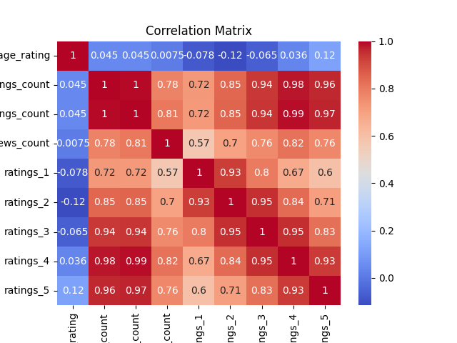
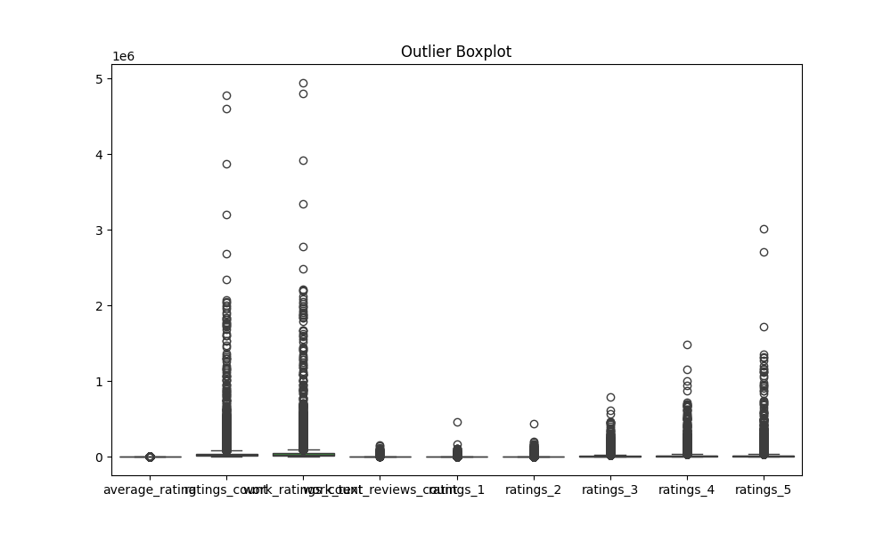

### Overview of the Dataset

The dataset contains information on 10,000 books, including various attributes such as book IDs, authors, publication years, ratings, and more. Below is a detailed analysis based on the provided summary statistics, insights into missing values, outliers, and correlation analysis.

#### Key Insights

1. **General Structure**:
   - The dataset consists of 10,000 entries, with most columns fully populated. The only missing values are found in `isbn` (700 missing), `isbn13` (585 missing), `original_publication_year` (21 missing), `original_title` (585 missing), and `language_code` (1084 missing).

2. **Ratings Overview**:
   - The average rating across all books is approximately 4.00, with a standard deviation of about 0.25, suggesting a fairly consistent rating among books. The ratings count and work-related metrics also show significant variation, with `ratings_count` having a mean of 54,001 and a maximum of over 4.7 million.

3. **Outliers**:
   - There are numerous outliers in various columns, particularly in `ratings_count`, `work_ratings_count`, and individual rating categories (`ratings_1` to `ratings_5`). For instance, the outlier count for `ratings_count` is 1163, indicating that some books receive an unusually high number of ratings compared to the majority.
   - The presence of outliers can skew the mean and inflate the perceived popularity of certain books. For example, a few bestsellers may dominate the ratings, which could mislead analyses focused on average ratings or total ratings.

4. **Correlation Analysis**:
   - The correlation matrix indicates that `average_rating` has a moderate positive correlation with `ratings_count` (0.45) and `work_ratings_count` (0.45). This suggests that books with more ratings tend to have higher average ratings.
   - The individual ratings (`ratings_1` to `ratings_5`) show high correlations with each other, indicating that if a book receives a high number of 5-star ratings, it likely receives fewer 1-star ratings, and vice versa.

5. **Language Distribution**:
   - The column `language_code` has 1084 missing values, suggesting that many books do not have a specified language. This could affect analyses that require language-specific insights.

#### Suggested Actions for Outliers

1. **Identification and Analysis**:
   - Further investigate the outliers to understand whether they represent legitimate entries (e.g., exceptionally popular books) or data entry errors. For example, books with extremely high ratings or counts should be examined to determine their impact on overall statistics.

2. **Handling Outliers**:
   - Depending on the analysis goals, consider using robust statistical methods that are less sensitive to outliers, such as median-based measures or trimming extreme values.
   - For regression analyses, consider using techniques like robust regression that are less influenced by outliers.

3. **Data Cleaning**:
   - Address missing values by either imputing them using statistical methods (e.g., mean, median, or mode) or removing entries with excessive missing data, particularly in critical columns like `isbn` or `original_title`.

4. **Normalization**:
   - Normalize the ratings data to reduce the impact of outliers, especially when comparing books across different genres or publication years.

5. **Segmentation**:
   - Segment the dataset into different categories (e.g., genres, publication years) to analyze trends without the distortion caused by outliers.

### Conclusion

The dataset provides a rich source of information about books, their ratings, and reader engagement. While it contains some missing values and outliers, careful analysis and handling of these issues can lead to meaningful insights. The correlation between ratings and counts highlights the importance of considering multiple metrics when evaluating book popularity and quality. Future analyses should focus on refining the dataset, addressing outliers, and exploring the relationships between variables to gain deeper insights into reader preferences and trends in the literary landscape.

