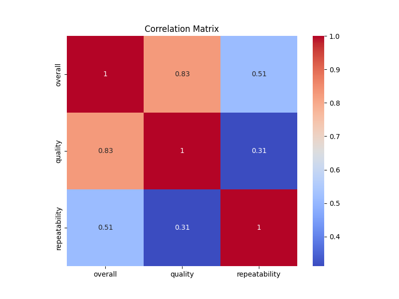

### Overview of the Dataset

The dataset consists of 2,553 entries, each representing a movie review characterized by various attributes, including date, language, type, title, reviewer, and ratings for overall experience, quality, and repeatability. Below is a detailed analysis based on the summary statistics and insights provided.

#### Key Insights

1. **Data Composition**:
   - **Date**: The dataset contains 2,553 entries, with 99 missing dates. This indicates a potential area for data cleaning or imputation.
   - **Language**: There are 11 unique languages, with English being the most frequent, appearing 1,306 times.
   - **Type**: All entries are categorized as movies, indicating a focused dataset.
   - **Title**: There are 2,312 unique movie titles, suggesting a diverse range of content.
   - **Reviewer**: 262 entries have missing reviewer names, which could affect the credibility of reviews.

2. **Rating Distributions**:
   - **Overall Ratings**: The mean overall rating is approximately 3.05, with a standard deviation of 0.76. The ratings range from 1 to 5, with 1 being the lowest and 5 the highest.
   - **Quality Ratings**: The average quality rating is around 3.21, with a slightly higher standard deviation of 0.80.
   - **Repeatability Ratings**: The repeatability ratings have a mean of approximately 1.49, suggesting that most reviews do not expect repeat viewings.

3. **Outliers**:
   - There are 1,216 outliers in the overall ratings, which is significant and may skew the mean value. The presence of outliers can distort the interpretation of the data, leading to misleading conclusions about the general sentiment of the reviews.
   - The quality ratings have 24 outliers, indicating that while most reviews are clustered around average ratings, a few reviews significantly deviate.
   - Repeatability ratings show no outliers, suggesting consistency in this metric.

4. **Correlation**:
   - The correlation matrix indicates a strong positive correlation between overall ratings and quality (0.83) and a moderate correlation between overall ratings and repeatability (0.51). This suggests that higher quality ratings often align with better overall experiences.

5. **Categorical Features**:
   - The categorical features, including date, language, type, title, and reviewer, contain missing values that may require attention to improve the dataset's completeness and usability.

#### Recommendations for Handling Outliers

1. **Identify and Analyze Outliers**: 
   - Conduct further analysis to understand the nature of the outliers. Are they due to genuine extreme opinions, or are they the result of data entry errors?

2. **Consider Removing or Capping Outliers**:
   - Depending on the analysis, it may be beneficial to remove outliers or cap them to the nearest non-outlier values to minimize their impact on overall statistics.

3. **Use Robust Statistical Measures**:
   - When analyzing the data, consider using median and interquartile range (IQR) instead of mean and standard deviation to provide a more robust summary that is less affected by outliers.

4. **Data Imputation for Missing Values**:
   - For the missing values in the date and reviewer fields, consider using imputation techniques or flagging these entries for further review.

5. **Regular Updates and Maintenance**:
   - Establish a routine for updating the dataset and reviewing the data quality to ensure ongoing accuracy and completeness.

### Conclusion

The dataset offers a wealth of information on movie reviews, but attention must be given to outliers and missing values to enhance its reliability. By implementing the suggested actions, the dataset can be transformed into a more robust tool for analysis, enabling better insights into movie ratings and viewer experiences.

