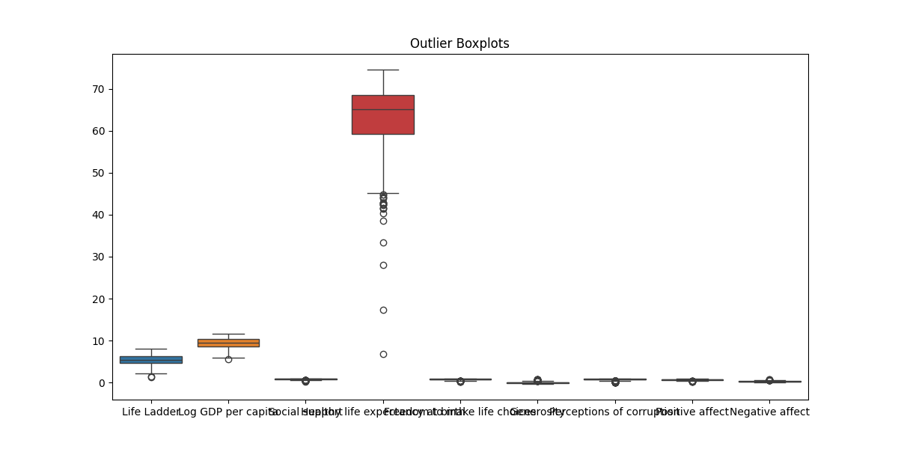

### Overview of the Dataset

The dataset comprises 2,363 entries, detailing various factors influencing well-being across 165 countries over multiple years. The key variables include the Life Ladder, Log GDP per capita, Social support, Healthy life expectancy at birth, Freedom to make life choices, Generosity, Perceptions of corruption, Positive affect, and Negative affect. 

#### Summary Statistics

1. **Life Ladder**: The average score is approximately 5.48, with a minimum of 1.28 and a maximum of 8.02. The standard deviation of 1.13 indicates moderate variability.
   
2. **Log GDP per capita**: The mean is around 9.40, ranging from 5.53 to 11.68, suggesting substantial economic diversity across countries.

3. **Social Support**: The average is 0.81, with a minimum of 0.23 and a maximum of 0.99. This indicates a generally high level of perceived social support.

4. **Healthy Life Expectancy**: The average is about 63.40 years, with a minimum of 6.72 years and a maximum of 74.6 years, reflecting disparities in health outcomes.

5. **Freedom to Make Life Choices**: The mean score is 0.75, indicating a generally high level of perceived freedom.

6. **Generosity**: This variable has a mean of approximately 0.0001, suggesting low levels of perceived generosity across the dataset.

7. **Perceptions of Corruption**: The average score is 0.74, with a notable variation as indicated by a standard deviation of 0.18.

8. **Positive Affect**: The average score is 0.65, indicating a generally positive emotional state among respondents.

9. **Negative Affect**: The mean is around 0.27, suggesting that negative emotions are less frequently reported.

### Missing Values

The dataset exhibits missing values across several columns:
- **Log GDP per capita**: 28 missing entries
- **Social support**: 13 missing entries
- **Healthy life expectancy**: 63 missing entries
- **Freedom to make life choices**: 36 missing entries
- **Generosity**: 81 missing entries
- **Perceptions of corruption**: 125 missing entries
- **Positive affect**: 24 missing entries
- **Negative affect**: 16 missing entries

This indicates potential gaps in data collection that could impact the analysis and interpretation of the results.

### Outliers

Outliers were identified in several variables:
- **Life Ladder**: 2 outliers
- **Log GDP per capita**: 1 outlier
- **Social support**: 48 outliers
- **Healthy life expectancy**: 20 outliers
- **Freedom to make life choices**: 16 outliers
- **Generosity**: 39 outliers
- **Perceptions of corruption**: 194 outliers
- **Positive affect**: 9 outliers
- **Negative affect**: 31 outliers

These outliers can significantly skew the results, particularly in measures of central tendency (mean, median) and variability (standard deviation). 

### Impact of Outliers

Outliers can distort the overall findings of the dataset, leading to potentially misleading conclusions. For instance, an unusually high GDP per capita or extreme perceptions of corruption could affect the average scores for those variables, masking the true experiences of the majority. 

### Recommendations for Handling Outliers

1. **Identification and Analysis**: Further investigate the outliers to determine if they are due to data entry errors, unique circumstances, or represent valid extreme cases.

2. **Transformation**: Consider applying transformations (e.g., logarithmic) to reduce the impact of outliers on the analysis.

3. **Robust Statistics**: Use robust statistical measures (e.g., median, interquartile range) to summarize data instead of means and standard deviations, which are sensitive to outliers.

4. **Imputation**: For missing values, consider imputation methods to fill gaps without introducing bias, ensuring the integrity of the dataset remains intact.

5. **Segmentation**: Analyze the data in segments based on economic or social classifications to understand how outliers influence different groups.

### Correlation Insights

The correlation matrix indicates strong relationships between various factors, particularly between overall well-being measures and economic indicators like Log GDP per capita. This suggests that economic prosperity may significantly influence perceived quality of life.

### Conclusion

The dataset provides a comprehensive view of well-being across countries, but careful attention is needed to address missing values and outliers. Implementing robust analytical techniques and conducting further investigations into outliers will enhance the reliability of the insights drawn from this data.

